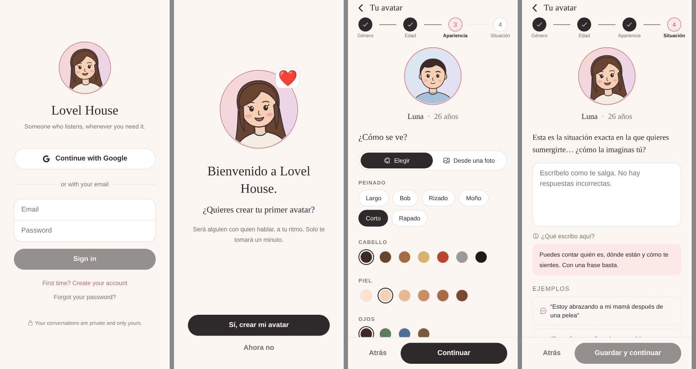
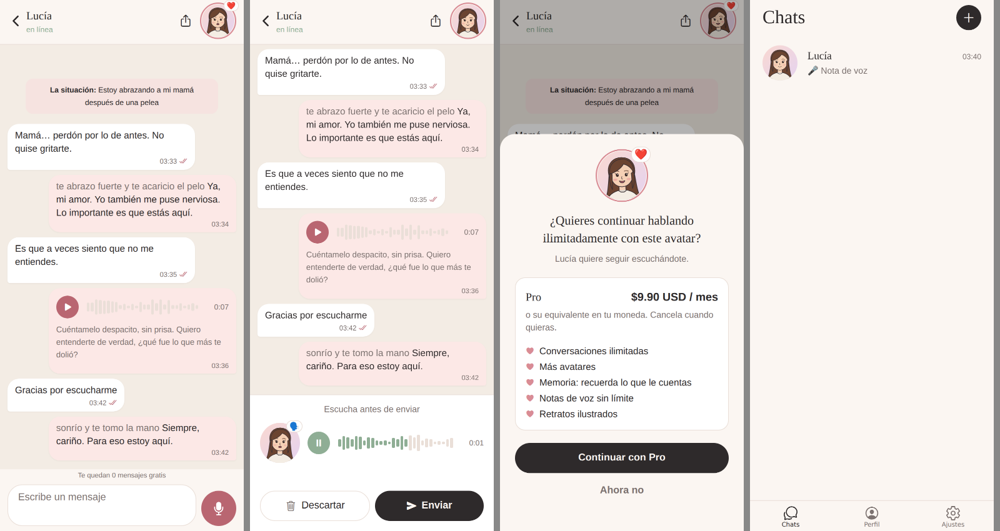

# Lovel House

Lovel House es una app minimalista de acompañantes: creas un avatar 2D de caricatura simple y conversas con él por texto o por voz, dentro de una situación que tú eliges ("Estoy abrazando a mi mamá después de una pelea", "Tu profesor explicando matemáticas con voz cálida"…).




---

## Qué incluye

| Flujo | Dónde está |
| --- | --- |
| Registro / login con Google y con email (más recuperar contraseña) | `src/app/login.tsx`, `src/lib/auth.tsx`, `src/app/auth/callback.tsx` |
| Bienvenida: "Bienvenido a Lovel House. ¿Quieres crear tu primer avatar?" | `src/app/welcome.tsx` |
| Creador de avatar en 4 pasos (género, edad 18–60, apariencia elegida o desde una foto, situación) | `src/app/avatar/create.tsx` |
| Chat estilo WhatsApp: scroll infinito, "escribiendo…", foto grande arriba a la derecha que se mueve, parpadea y "habla" (❤️ / 🗣️) | `src/app/chat/[avatarId].tsx` |
| Notas de voz: botón de micrófono grande, onda en vivo, vista previa con labios en movimiento y respuesta con voz generada | `src/components/VoiceRecorder.tsx`, `supabase/functions/voice-chat` |
| Plan Pro de $9.90/mes (solo suscripción). El modal aparece tras 5 mensajes o 2 minutos | `src/components/PaywallModal.tsx`, `src/app/pro.tsx`, `supabase/functions/create-checkout`, `stripe-webhook` |
| Exportar la conversación: HTML con texto y audios incrustados, o .txt | `src/lib/exportConversation.ts` |
| Lista de avatares (historial), perfil y ajustes (idioma, privacidad, borrar datos) | `src/app/(tabs)/*` |
| Prompt de sistema del avatar: humano, delicado y fiel a la situación | `supabase/functions/_shared/systemPrompts.tsx` |

### Plan gratuito y plan Pro

- **Gratis:** 1 avatar y un periodo de prueba de 5 mensajes o 2 minutos de conversación (lo que ocurra primero). El backend lo aplica con un 402 `PAYWALL`, así que no se puede saltar desde la app.
- **Pro ($9.90 USD/mes):** mensajes y notas de voz ilimitados, avatares ilimitados, memoria de largo plazo (el avatar recuerda lo que le cuentas) y retratos ilustrados con Leonardo.ai.

---

## Arquitectura

```
┌──────────────────────────────┐        ┌───────────────────────────────────────────┐
│  App (Expo / React Native)   │  JWT   │  Supabase                                  │
│  Expo Router + NativeWind    │ ─────▶ │  Auth (Google + email)                     │
│  Avatar SVG + Reanimated     │        │  Postgres + RLS (profiles, avatars,        │
│  Lottie · expo-audio         │        │    conversations, messages)                │
└──────────────────────────────┘        │  Storage (voice-messages, portraits)       │
                                         │  Edge Functions (Deno) ─┬─▶ Claude API     │
                                         │                         ├─▶ ElevenLabs     │
                                         │                         ├─▶ Leonardo.ai    │
                                         │                         └─▶ Stripe         │
                                         └───────────────────────────────────────────┘
```

- **Ninguna clave secreta llega al teléfono.** La app solo tiene la URL de Supabase y la anon key. Claude, ElevenLabs, Leonardo y Stripe se llaman desde las Edge Functions.
- **Los mensajes los escribe solo el backend** (con service role), para que el límite gratuito no se pueda saltar. La app solo puede leer sus propios datos (RLS).

### Tecnologías elegidas

| Pieza | Elección | Motivo |
| --- | --- | --- |
| Frontend | **Expo SDK 57 + React Native 0.86 + Expo Router** | Una base de código para iOS, Android y web |
| Estilos | **NativeWind 4 (Tailwind)** + componentes propios (`src/components/ui.tsx`) | shadcn/Radix son solo para web; en móvil hacemos lo mismo con Tailwind |
| Animación | **Reanimated 4** (springs y transiciones declarativas) + **Lottie** | Framer Motion no funciona en React Native; Reanimated es el equivalente nativo |
| Backend | **Supabase** (Auth, Postgres, Storage, Edge Functions) | Lo recomendado en el brief; RLS y funciones en un solo lugar |
| Chat IA | **Claude Opus 5** (`claude-opus-5`) con SDK oficial `@anthropic-ai/sdk` | Pensamiento adaptativo, caché del prompt y `fallbacks: "default"` (si una petición se rechaza, la API la reintenta en el modelo recomendado) |
| Voz | **ElevenLabs**: `eleven_multilingual_v2` (TTS) + `scribe_v1` (STT) | Voz cálida en varios idiomas y transcripción precisa |
| Retratos | **Leonardo.ai** con prompt negativo (sin realismo, 3D, anime pesado ni artefactos de IA) | Soporta prompts negativos |
| Pagos | **Stripe Checkout** (suscripción) + Customer Portal | Suscripción mensual, cancelable |

### El avatar 2D

El avatar se dibuja en SVG a partir de rasgos (`src/lib/avatarGeometry.ts`): líneas limpias, fondo en degradado y expresión suave. Por eso se puede animar pieza por pieza (`src/components/CartoonAvatar.tsx`, `AnimatedAvatar.tsx`):

- **Parpadeo** natural cada 2–5 s.
- **Cabeza:** respira en reposo, se inclina al pensar ("escribiendo…") y asiente al hablar.
- **Expresiones:** neutral, sonriendo, pensando (ceja levantada) y hablando (boca animada).
- **Indicador:** ❤️ al responder por texto y 🗣️ al responder por voz.

El avatar de referencia (`REFERENCE_APPEARANCE`) es la chica de pelo castaño largo, suéter crema y fondo durazno→lavanda. Es el que aparece en la bienvenida y el que se usa por defecto. Los iconos de la app (`assets/images/*`) se generan desde ese mismo SVG con `bun scripts/render-avatar.ts`.

---

## Estructura del proyecto

```
lovel-chatbot/
├── app.json                      # Configuración de Expo (nombre, esquema lovelhouse://, permisos)
├── package.json
├── babel.config.js · metro.config.js · tailwind.config.js · nativewind-env.d.ts
├── .env.example                  # Variables públicas de la app
├── assets/
│   ├── images/                   # Icono, splash, favicon, retrato de referencia
│   └── lottie/                   # typing.json (puntitos) · soundwave.json (ondas)
├── scripts/
│   ├── render-avatar.ts          # Genera los PNG desde el SVG del avatar
│   └── make-lottie.mjs           # Genera las animaciones Lottie
├── src/
│   ├── app/                      # Pantallas (Expo Router)
│   │   ├── _layout.tsx           # Proveedores + rutas protegidas
│   │   ├── index.tsx             # Decide: login / bienvenida / chats
│   │   ├── login.tsx · welcome.tsx · pro.tsx
│   │   ├── auth/callback.tsx     # Retorno de Google / enlaces de correo
│   │   ├── avatar/create.tsx     # Creador de avatar (4 pasos)
│   │   ├── chat/[avatarId].tsx   # Chat principal
│   │   └── (tabs)/               # Chats · Perfil · Ajustes
│   ├── components/               # CartoonAvatar, AnimatedAvatar, ChatBubble, VoiceRecorder,
│   │                             # VoicePlayer, PaywallModal, SituationField, StepDiagram, ui…
│   ├── constants/theme.ts
│   ├── global.css
│   └── lib/                      # supabase, auth, i18n (es/en), data, billing, audio,
│                                 # exportConversation, avatarGeometry, types
└── supabase/
    ├── config.toml · deploy.sh · .env.example
    ├── migrations/0001_init.sql  # Tablas, RLS, triggers, vista de chats, buckets
    └── functions/
        ├── _shared/              # systemPrompts.tsx, claude.ts, elevenlabs.ts, stripe.ts, quota.ts…
        ├── chat/                 # Texto → respuesta del avatar
        ├── voice-chat/           # Voz → transcripción → respuesta → voz
        ├── analyze-appearance/   # Foto → rasgos del avatar (Claude visión; la foto no se guarda)
        ├── generate-avatar/      # Retrato ilustrado (Leonardo.ai, Pro)
        ├── create-checkout/      # Stripe Checkout $9.90/mes
        ├── checkout-return/      # Redirige de Stripe a la app
        ├── billing-portal/       # Portal de Stripe
        ├── stripe-webhook/       # Activa o desactiva Pro
        └── delete-data/          # Borrar conversaciones o la cuenta
```

---

## Cómo ponerlo en marcha

### 1. Requisitos

- Node 20 o superior
- [Supabase CLI](https://supabase.com/docs/guides/cli)
- Cuentas en Anthropic, ElevenLabs, Leonardo.ai y Stripe
- Expo Go en tu teléfono o un simulador

### 2. Supabase

```bash
supabase login
supabase link --project-ref TU_PROJECT_REF
cp supabase/.env.example supabase/.env      # rellena tus claves
bash supabase/deploy.sh                     # migraciones + secretos + funciones
```

En el panel de Supabase:

1. **Authentication → URL Configuration:** añade `lovelhouse://**`, `exp://**` y, para web, `http://localhost:8081/**` a *Redirect URLs*.
2. **Authentication → Providers → Google:** activa Google con el Client ID y el Secret de Google Cloud. En Google Cloud, la URL de redirección autorizada es `https://TU_PROJECT_REF.supabase.co/auth/v1/callback`.

### 3. Stripe

1. En **Developers → Webhooks**, crea un endpoint hacia `https://TU_PROJECT_REF.supabase.co/functions/v1/stripe-webhook` con los eventos `checkout.session.completed`, `customer.subscription.created`, `customer.subscription.updated` y `customer.subscription.deleted`. Copia el *signing secret* en `STRIPE_WEBHOOK_SECRET`.
2. Activa el **Customer Portal** (Settings → Billing → Customer portal).
3. Para mostrar el precio en la moneda de cada país, activa **Adaptive Pricing** en Stripe.
4. Opcional: crea un precio recurrente de $9.90/mes y pon su id en `STRIPE_PRICE_ID`. Si no lo pones, la función usa $9.90 USD/mes directamente.

### 4. La app

```bash
cp .env.example .env     # EXPO_PUBLIC_SUPABASE_URL y EXPO_PUBLIC_SUPABASE_ANON_KEY
npm install
npx expo start
```

Escanea el QR con Expo Go, o pulsa `i` (iOS), `a` (Android) o `w` (web).

---

## Configuración de las APIs

| Secreto | Para qué | Dónde se consigue |
| --- | --- | --- |
| `ANTHROPIC_API_KEY` | Respuestas del avatar, memoria y análisis de fotos | console.anthropic.com |
| `CLAUDE_MODEL` (opcional) | Modelo; por defecto `claude-opus-5` | — |
| `CLAUDE_EFFORT` (opcional) | `low` (por defecto, respuestas rápidas), `medium` o `high` | — |
| `ELEVENLABS_API_KEY` | Voz del avatar y transcripción de notas de voz | elevenlabs.io → Profile → API Keys |
| `ELEVENLABS_VOICE_*` (opcional) | Voces por género y edad. También puedes poner una voz clonada en `avatars.voice_id` | ElevenLabs → Voices |
| `LEONARDO_API_KEY` | Retratos ilustrados (Pro) | app.leonardo.ai → API Access |
| `STRIPE_SECRET_KEY` · `STRIPE_WEBHOOK_SECRET` | Suscripción Pro | dashboard.stripe.com |
| `ALLOWED_RETURN_URLS` | A dónde puede volver el usuario tras pagar (evita redirecciones abiertas) | Añade tu dominio web si publicas la versión web |

La personalidad del avatar está en `supabase/functions/_shared/systemPrompts.tsx`. Ahí se definen el tono (cálido, frases cortas, primero escucha), la fidelidad a la situación, los gestos entre asteriscos (la app los muestra en un tono más suave) y los límites de cuidado: nada de contenido sexual explícito, trato protector si parece menor, honestidad si le preguntan en serio si es una persona real, y apoyo si alguien habla de hacerse daño.

---

## Notas

- **Expo Go:** todas las librerías nativas usadas (SVG, Reanimated, Lottie, expo-audio, slider) vienen incluidas en Expo Go. Para publicar en las tiendas, usa `npx eas-cli build`.
- **App Store y pagos:** Apple puede exigir compras dentro de la app (StoreKit) para suscripciones digitales, según el país. Stripe Checkout funciona sin cambios en web y Android. Para iOS en algunos países puede hacer falta añadir IAP (por ejemplo con RevenueCat) usando el mismo campo `profiles.is_pro`.
- **Privacidad:** los audios se guardan en un bucket privado y se sirven con URLs firmadas. Si el usuario desactiva "Guardar mis notas de voz", su audio solo se transcribe y no se guarda. Las fotos de referencia nunca se guardan.
- **Idioma:** la interfaz está en español e inglés (`src/lib/i18n.tsx`). El avatar responde en el idioma en que le escriben.

### Comprobaciones

```bash
npx tsc --noEmit                                 # tipos de la app
deno check --no-config supabase/functions/*/index.ts   # tipos de las Edge Functions
```

---

## Comando para arrancar

```bash
npm install && npx expo start
```
