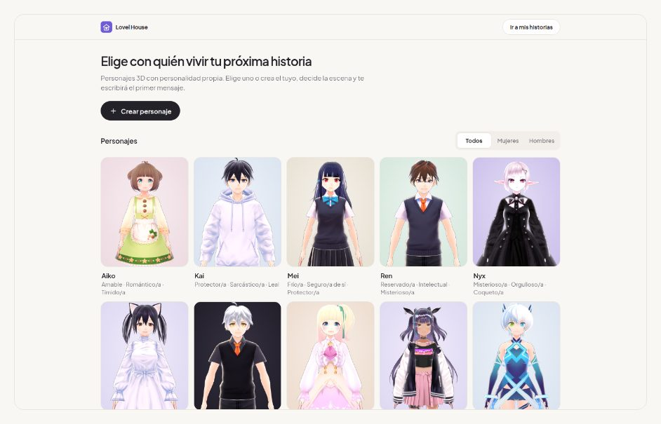
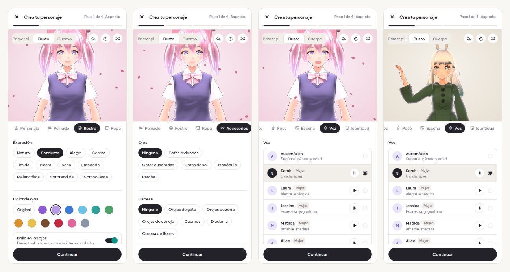
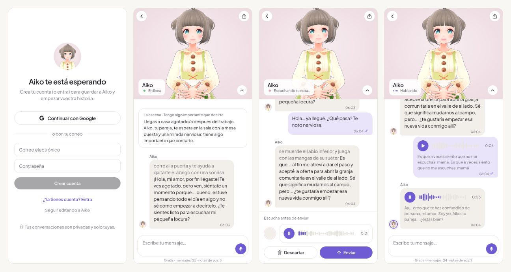
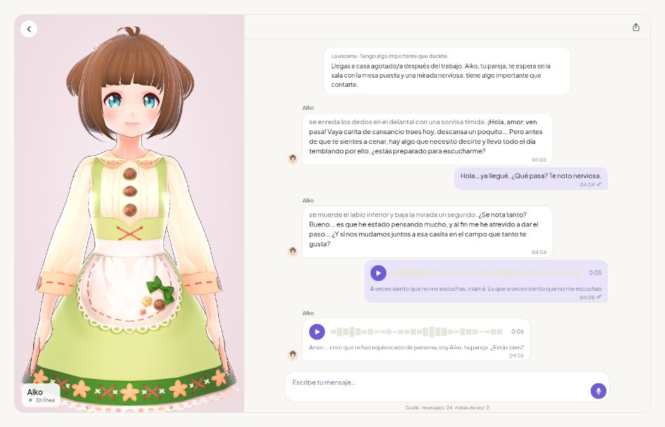
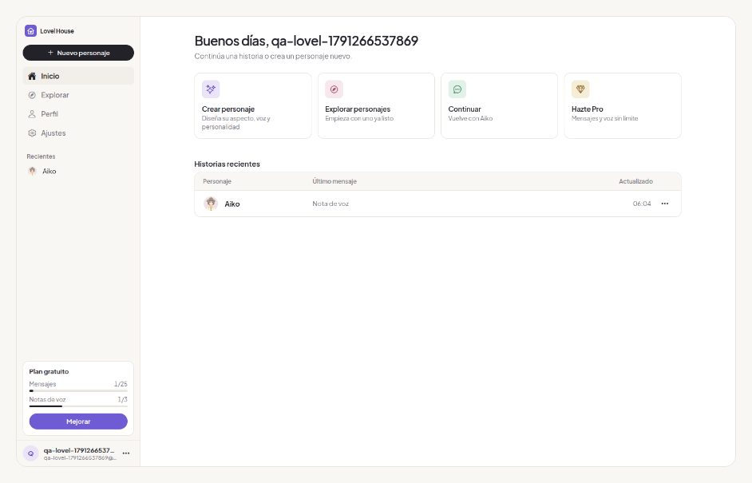

# Lovel House

Lovel House es una app de **roleplay con personajes**: eliges o creas un personaje **anime 3D (VRM, el formato de los VTubers)**, defines su personalidad y la escena donde empieza vuestra historia… y **el personaje te escribe primero**. Después conversáis por texto o por notas de voz.

Prioridad del producto: **Personaje → Personalidad → Situación → Conversación.**







---

## Qué incluye

| Flujo | Dónde está |
| --- | --- |
| **Entrada sin cuenta:** una frase sobre Lovel House y tres preguntas (con quién, qué edad, qué situación). Lovel House elige al personaje, abre una sesión de **invitado** (anónima de Supabase) y te lleva **directo al chat**, donde el personaje escribe primero. Desde el chat, **Personalizar** abre el editor completo. El invitado tiene 10 mensajes y sin notas de voz; al crear su cuenta (correo o Google) conserva personaje y conversación y pasa al plan gratuito | `src/app/welcome.tsx`, `src/app/index.tsx`, `src/lib/auth.tsx`, `supabase/functions/_shared/quota.ts` |
| Creador 3D en vivo, con 9 secciones: **Personaje** (14 modelos VRM: cara, cuerpo y ropa distintos, o importar un .vrm de VRoid Studio) · **Peinado** (10 estilos, 18 colores, puntas en degradado) · **Rostro** (11 expresiones, 12 colores de ojos, ojos con o sin brillo, 8 tonos de piel, rubor, labios, sombra de ojos y 8 marcas: pecas, lunar, sonrojo anime, estrella, corazón, lágrima, cicatriz, bigotes) · **Ropa** (color por piezas: superior, inferior, calzado y detalles) · **Accesorios** (19, uno por zona: gafas, monóculo, parche, orejas de gato/zorro/conejo, cuernos, diadema, corona de flores, aureola, lazo, flor, horquilla, auriculares, alas de ángel/demonio/hada, con color propio) · **Pose** (6 poses e inclinación, giro y tamaño de la cabeza) · **Escena** (16 fondos, 7 luces, 6 efectos de ambiente, contorno y brillo) · **Voz** (15 voces de ElevenLabs con muestra, velocidad y expresividad) · **Identidad**. Con deshacer, restablecer, aleatorio y vista cara/busto/cuerpo | `src/app/avatar/create.tsx`, `src/lib/character/*`, `src/components/VrmAvatar.tsx`, `avatar-stage/stage.html` |
| 12 personajes listos, cada uno con su voz | `PRESETS` en `src/lib/character/catalog.ts` |
| Personalidad: 30 rasgos, de 1 a 5, con incompatibilidades (tímido ↔ extrovertido, dominante ↔ sumiso…) | `supabase/functions/_shared/roleplay.ts` |
| 36 escenarios narrativos en 9 categorías (Romance, Drama, Amistad, Escuela, Trabajo, Fantasía, Misterio, Conflicto, Vida cotidiana) o una escena propia | `supabase/functions/_shared/roleplay.ts` |
| El personaje envía el **primer mensaje**, coherente con su personalidad y la escena | `supabase/functions/start-chat`, `buildOpeningInstruction` en `systemPrompts.tsx` |
| Chat con el personaje en 3D como protagonista (arriba en móvil, panel lateral en escritorio). Estados: **reposo, escribiendo, escuchando, hablando, sin conexión** — el 3D mueve los labios, la foto de perfil emite ondas y la etiqueta de estado cambia; con notas de voz, "hablando" dura exactamente lo que suena el audio. Tus mensajes a la derecha; los suyos a la izquierda con su foto y nombre | `src/app/chat/[avatarId].tsx`, `src/components/{ChatBubble,AnimatedAvatar,PresencePill,TypingIndicator}.tsx` |
| Notas de voz con estados claros (preparando, grabando, vista previa, enviando) y mensajes de error de permisos/micrófono en web y móvil. Si la voz falla, el personaje responde por escrito | `src/components/VoiceRecorder.tsx`, `supabase/functions/voice-chat` |
| Login con Google y con email (más recuperar contraseña) | `src/app/login.tsx`, `src/lib/auth.tsx`, `src/app/auth/callback.tsx` |
| Plan Pro de $9.90/mes (Stripe) | `src/components/PaywallModal.tsx`, `src/app/pro.tsx`, `supabase/functions/create-checkout`, `stripe-webhook` |
| Exportar la conversación (HTML con audios o .txt), historias, perfil y ajustes | `src/lib/exportConversation.ts`, `src/app/(tabs)/*` |

### Plan gratuito y plan Pro

- **Gratis:** 1 personaje, **25 mensajes de texto** y **3 notas de voz** por cuenta. El contador se ve en el chat y en el perfil. Lo controla el servidor: la función `reserve_free_message` reserva el cupo de forma atómica **antes** de llamar a la IA (tres peticiones simultáneas con un solo mensaje libre → una pasa y dos reciben 402 `PAYWALL`) y lo devuelve si la respuesta falla. No se reinicia al recargar ni al borrar personajes, y solo el backend puede modificarlo. El primer mensaje del personaje no cuenta.
- **Pro ($9.90 USD/mes):** mensajes y notas de voz ilimitados, más personajes y memoria de largo plazo.

---

## Arquitectura

```
┌──────────────────────────────┐        ┌───────────────────────────────────────────┐
│  App (Expo / React Native)   │  JWT   │  Supabase                                  │
│  Expo Router + NativeWind    │ ─────▶ │  Auth (Google + email)                     │
│  Personajes VRM (three.js)   │        │  Postgres + RLS (profiles, avatars,        │
│  Reanimated · expo-audio     │        │    conversations, messages)                │
└──────────────────────────────┘        │  Storage (voice-messages)                  │
                                         │  Edge Functions (Deno) ─┬─▶ Gemini/Claude  │
                                         │                         ├─▶ ElevenLabs     │
                                         │                         └─▶ Stripe         │
                                         └───────────────────────────────────────────┘
```

- **Ninguna clave secreta llega al teléfono.** La app solo tiene la URL de Supabase y la anon key.
- **Los mensajes los escribe solo el backend** (service role), para que el plan gratuito no se pueda saltar.

### Tecnologías

| Pieza | Elección |
| --- | --- |
| Frontend | Expo SDK 57 + React Native 0.86 + Expo Router (iOS, Android y web) |
| Estilos | NativeWind 4 (Tailwind) + componentes propios (`src/components/ui.tsx`) |
| Tipografía | Solo Plus Jakarta Sans (400/500/600/700) con `@expo-google-fonts`. Sin serif ni cursiva en ningún sitio |
| Personajes | Modelos VRM con licencia comercial (ver `avatar-stage/MODELS.md`) renderizados con three.js + `@pixiv/three-vrm` en un WebView (iframe en web). Archivos en Supabase Storage (`vrm-models`) |
| Chat IA | Gemini 3.5 Flash-Lite por defecto o Claude (`AI_PROVIDER`) |
| Voz | ElevenLabs `eleven_multilingual_v2` (TTS) + `scribe_v1` (STT) |
| Pagos | Stripe Checkout + Customer Portal |

### Identidad visual (modo claro)

| Token | Color | Uso |
| --- | --- | --- |
| `cream` | `#F9F7F3` | Fondo |
| `paper` | `#FFFFFF` | Tarjetas y superficies |
| `primary` / `primary-soft` | `#6F5BD3` / `#E9E4FA` | Interacción: selección, foco, enlaces, enviar, tus mensajes (no se usa como fondo grande) |
| `accent` / `accent-soft` | `#E6A0B4` / `#F8E8ED` | Acentos emocionales, escena |
| `ink` / `muted` | `#242229` / `#77737D` | Texto principal y secundario |
| `line` | `#E8E4DE` | Bordes |
| `success` | `#69B58A` | En línea |

Los tokens están en `tailwind.config.js` y `src/constants/theme.ts`. El plugin `fontWeight` de Tailwind está desactivado a propósito: `font-medium`, `font-semibold`, `font-bold`… eligen el archivo de fuente correcto (las fuentes propias no admiten peso sintético en Android). `Text` y `TextInput` se importan de `src/components/Themed.tsx` para usar la fuente de la marca por defecto.

### Sistema de interfaz

Prioridades: **claridad → jerarquía → función → personalidad.** Superficies blancas con borde de 1 px sobre fondo crema, sin sombras, degradados ni glassmorphism. Botón principal en tinta (`ink`), el violeta se reserva para la interacción. Una sola familia tipográfica con escala corta (28/20/16/15/13/12 px) y tracking negativo en titulares. Componentes en `src/components/ui.tsx`: `Button`, `IconButton`, `Tag`, `Segmented`, `Swatch`, `Card`, `ListRow`, `Field`, `ToggleRow`, `EmptyState`. Navegación: barra inferior en móvil y barra lateral en escritorio (≥ 900 px).

### Los personajes

Estética **VTuber adulta** por defecto: sombreado anime plano (sombra de corte limpio, casi sin contorno de luz), luz frontal de stream, proporciones adultas (cabeza algo más pequeña), ropa lisa sin estampados y fondos ilustrados (atardecer, ciudad de noche, cielo estrellado, aurora, amanecer, habitación). Todo se puede cambiar en el editor.

Personajes 3D estilo anime (formato VRM, el de los VTubers), con proporciones, ojos detallados, pelo con física (spring bones) y ropa elaborada; luz de estudio propia (key, fill, rim) y fondos con los colores de la marca. Cada modelo base es un personaje distinto, no un recoloreado. El 3D en vivo aparece en el creador y en el chat (respira, parpadea, mueve los labios al hablar, ladea la cabeza al pensar o escuchar); en listas y burbujas se usa una foto capturada del propio 3D para no cargar WebGL de más. Ningún personaje, asset ni paleta procede de juegos comerciales.

---

## Estructura del proyecto

```
lovel-chatbot/
├── app.json · package.json · tailwind.config.js
├── assets/            # Iconos (logo), characters/ (retratos capturados del 3D), Lottie
├── avatar-stage/      # stage.html (three.js + three-vrm) · MODELS.md (licencias)
├── scripts/           # build-stage.mjs · render-characters.mjs · render-brand.ts
├── src/
│   ├── app/
│   │   ├── _layout.tsx           # Fuentes, diálogos y rutas públicas/protegidas
│   │   ├── index.tsx             # Decide: explorar / crear el personaje pendiente / historias
│   │   ├── explore.tsx           # Puerta de entrada (sin cuenta)
│   │   ├── avatar/create.tsx     # Creador: aspecto → personalidad → escena → vista previa
│   │   ├── login.tsx · start.tsx · pro.tsx
│   │   ├── auth/callback.tsx     # Retorno de Google / enlaces de correo
│   │   ├── chat/[avatarId].tsx   # Chat
│   │   └── (tabs)/               # Historias · Perfil · Ajustes
│   ├── components/    # VrmAvatar, AnimatedAvatar, PresencePill, ChatBubble, TypingIndicator, VoiceRecorder, VoicePlayer, PaywallModal, Themed, ui…
│   └── lib/
│       ├── character/            # catalog (modelos, peinados, colores, presets), media (retratos), types
│       ├── avatarStageHtml.ts    # stage.html empaquetado (node scripts/build-stage.mjs)
│       ├── roleplay.ts           # Rasgos y escenarios (misma fuente que el backend)
│       ├── draft.ts · createCharacter.ts · dialog.tsx
│       └── supabase, auth, i18n (es/en), data, billing, audio, exportConversation, types
└── supabase/
    ├── migrations/               # 0001 esquema · 0002 buckets · 0003 roleplay + cupos
    └── functions/
        ├── _shared/              # roleplay.ts, systemPrompts.tsx, llm.ts, quota.ts, elevenlabs.ts…
        ├── start-chat/           # Primer mensaje del personaje
        ├── chat/ · voice-chat/   # Texto y voz
        └── create-checkout/ · checkout-return/ · billing-portal/ · stripe-webhook/ · delete-data/
```

---

## Invitados (Supabase)

En *Authentication* están activados **Anonymous sign-ins** (para entrar sin cuenta) y **Manual linking** (para vincular Google a la cuenta del invitado). Al crear la cuenta con correo, la sesión del invitado se convierte en una cuenta normal (mismo usuario).

## Login con Google: qué faltaba y cómo activarlo

**Por qué fallaba:** en Supabase el proveedor Google estaba **desactivado y sin Client ID/Secret**. Al pulsar el botón, Supabase respondía con una página de error ("provider is not enabled"). Además había dos problemas en el código, ya corregidos: la pantalla de retorno redirigía antes de que la sesión estuviera lista, y la *Site URL* era `lovelhouse://` (en web, cualquier redirección no permitida acababa en una URL que el navegador no puede abrir; ahora es `https://lovel-house.expo.app`). Ahora la app comprueba antes si Google está activado y, si no, muestra un aviso claro en lugar de la página de error.

**Para activarlo (una sola vez):**

1. **Google Cloud Console** → APIs y servicios → Pantalla de consentimiento de OAuth: tipo *Externo*, nombre "Lovel House", tu correo de soporte. Publica la app (o añade tus correos como usuarios de prueba).
2. **Credenciales → Crear credenciales → ID de cliente de OAuth → Aplicación web.**
   - *Orígenes de JavaScript autorizados:* `https://lovel-house.expo.app`
   - *URI de redireccionamiento autorizados:* `https://snzcphkpzbjdzqjhzgzu.supabase.co/auth/v1/callback`
3. **Supabase → Authentication → Sign In / Providers → Google:** activa Google y pega el *Client ID* y el *Client Secret*. Guarda.
4. Ya está: *URL Configuration* ya tiene `https://lovel-house.expo.app/**`, `lovelhouse://**`, `exp://**` y `http://localhost:8081/**` como URLs de retorno permitidas.

No hace falta ninguna variable nueva en la app. El Client Secret solo va en el panel de Supabase (nunca en el código ni en el chat).

## Versión publicada

La versión web está publicada con EAS Hosting en **https://lovel-house.expo.app** (se abre en el navegador del teléfono). Para volver a publicar tras un cambio:

```bash
npx expo export --platform web && npx eas-cli@latest deploy --prod
```

## Estado del proyecto de Supabase

Ya está desplegado en el proyecto **lovel-house** (`snzcphkpzbjdzqjhzgzu`): tablas, reglas de seguridad, buckets, migraciones 0001–0003, las 8 Edge Functions y los secretos de Gemini y ElevenLabs. La app ya trae la URL y la clave pública de ese proyecto (`src/constants/supabaseConfig.ts`), así que no hace falta crear `.env`.

Mientras estés en pruebas, la confirmación por correo está desactivada, porque el correo gratuito de Supabase solo envía a los miembros de tu equipo. Antes de lanzar, configura un SMTP propio en Authentication → Emails y vuelve a activarla.

## Cómo ponerlo en marcha (desde cero, en otro proyecto)

### 1. Requisitos

- Node 20 o superior
- [Supabase CLI](https://supabase.com/docs/guides/cli)
- Cuentas en Google AI Studio (Gemini) o Anthropic, ElevenLabs y Stripe
- Expo Go en tu teléfono o un simulador

### 2. Supabase

```bash
supabase login
supabase link --project-ref TU_PROJECT_REF
cp supabase/.env.example supabase/.env      # rellena tus claves
bash supabase/deploy.sh                     # migraciones + secretos + funciones
```

En el panel de Supabase:

1. **Authentication → URL Configuration:** *Site URL* = tu dominio web; en *Redirect URLs* añade `lovelhouse://**`, `exp://**`, `http://localhost:8081/**` y `https://TU_DOMINIO/**`.
2. **Authentication → Providers → Google:** sigue los pasos de la sección *Login con Google* de arriba.

### 3. Stripe (activar los pagos del plan Pro)

El código ya está desplegado; solo faltan las claves. Mientras no estén, el botón «Hazte Pro» muestra «Los pagos todavía no están activados» en vez de fallar.

1. **Cuenta y modo prueba.** Entra en [dashboard.stripe.com](https://dashboard.stripe.com) y deja activado *Test mode* (arriba a la derecha) para probar sin cobrar.
2. **Clave secreta.** *Developers → API keys* → copia la **Secret key** (`sk_test_…`).
3. **Producto y precio (opcional).** *Product catalog → Add product* → «Lovel House Pro», precio **recurrente** de **9.90 USD / mes** → copia el **Price ID** (`price_…`). Si te lo saltas, la función crea el precio de 9.90 USD/mes al vuelo.
4. **Webhook.** *Developers → Webhooks → Add endpoint*:
   - URL: `https://snzcphkpzbjdzqjhzgzu.supabase.co/functions/v1/stripe-webhook`
   - Eventos: `checkout.session.completed`, `customer.subscription.created`, `customer.subscription.updated`, `customer.subscription.deleted`
   - Guarda y copia el **Signing secret** (`whsec_…`).
5. **Portal de clientes.** *Settings → Billing → Customer portal* → **Activate** (permite cancelar la suscripción y cambiar de tarjeta).
6. **Secretos en Supabase** (nunca en el código ni en el chat). [Dashboard de Supabase](https://supabase.com/dashboard/project/snzcphkpzbjdzqjhzgzu/settings/functions) → *Edge Functions → Secrets* → añade:
   - `STRIPE_SECRET_KEY` = `sk_test_…`
   - `STRIPE_WEBHOOK_SECRET` = `whsec_…`
   - `STRIPE_PRICE_ID` = `price_…` (opcional)
   Las funciones los leen al momento; no hay que volver a desplegar.
7. **Prueba.** En la app: *Perfil → Hazte Pro* → paga con la tarjeta de prueba `4242 4242 4242 4242` (cualquier fecha futura y CVC). Al volver, el perfil pasa a **Pro** (lo activa el webhook en unos segundos). En Stripe → *Webhooks* verás los eventos con respuesta 200.
8. **Pasar a real.** Repite los pasos 2–6 con *Test mode* desactivado (claves `sk_live_…` y un webhook nuevo en modo live) y sustituye los tres secretos. Para cobrar en la moneda de cada país, activa **Adaptive Pricing** (*Settings → Payments*).

### 4. La app

```bash
cp .env.example .env     # EXPO_PUBLIC_SUPABASE_URL y EXPO_PUBLIC_SUPABASE_ANON_KEY
npm install
npx expo start
```

Escanea el QR con Expo Go, o pulsa `i` (iOS), `a` (Android) o `w` (web).

---

## Configuración de las APIs

| Secreto | Para qué | Dónde se consigue |
| --- | --- | --- |
| `AI_PROVIDER` | `gemini` (gratis) o `anthropic` (Claude). Cambia de IA sin tocar código | — |
| `GEMINI_API_KEY` | Respuestas del personaje y memoria con Gemini | aistudio.google.com/apikey |
| `GEMINI_MODEL` (opcional) | Por defecto `gemini-3.5-flash-lite` | — |
| `ANTHROPIC_API_KEY` | Lo mismo con Claude (si `AI_PROVIDER=anthropic`) | console.anthropic.com |
| `CLAUDE_MODEL` · `CLAUDE_EFFORT` (opcional) | Modelo (`claude-opus-5`) y esfuerzo (`low` por defecto) | — |
| `ELEVENLABS_API_KEY` | Voz del avatar y transcripción de notas de voz | elevenlabs.io → Profile → API Keys |
| `ELEVENLABS_VOICE_*` (opcional) | Voces por género y edad. También puedes poner una voz clonada en `avatars.voice_id` | ElevenLabs → Voices |
| `STRIPE_SECRET_KEY` · `STRIPE_WEBHOOK_SECRET` | Suscripción Pro | dashboard.stripe.com |
| `ALLOWED_RETURN_URLS` | A dónde puede volver el usuario tras pagar (evita redirecciones abiertas) | Añade tu dominio web si publicas la versión web |

El comportamiento del personaje está en `supabase/functions/_shared/systemPrompts.tsx` (identidad, personalidad a partir de los rasgos, escena, estilo roleplay breve con una acción entre asteriscos, primer mensaje) y los rasgos/escenarios en `roleplay.ts`. Límites de cuidado: nada de contenido sexual explícito, conflictos solo dentro de la ficción, trato protector si parece menor, honestidad si le preguntan en serio si es una persona real, y apoyo si alguien habla de hacerse daño.

---

## Notas

- **Expo Go:** todas las librerías nativas usadas (WebView, SVG, Reanimated, Lottie, expo-audio, fuentes) vienen incluidas en Expo Go. Para publicar en las tiendas, usa `npx eas-cli build`.
- **App Store y pagos:** Apple puede exigir compras dentro de la app (StoreKit) para suscripciones digitales, según el país. Stripe Checkout funciona sin cambios en web y Android. Para iOS en algunos países puede hacer falta añadir IAP (por ejemplo con RevenueCat) usando el mismo campo `profiles.is_pro`.
- **Privacidad:** los audios se guardan en un bucket privado y se sirven con URLs firmadas. Si el usuario desactiva "Guardar mis notas de voz", su audio solo se transcribe y no se guarda.
- **Idioma:** la interfaz está en español e inglés (`src/lib/i18n.tsx`). El personaje responde en el idioma en que le escriben.

### Comprobaciones

```bash
npx tsc --noEmit                                 # tipos de la app
npx expo lint                                    # lint
deno check --no-config supabase/functions/*/index.ts   # tipos de las Edge Functions
```

---

## Comando para arrancar

```bash
npm install && npx expo start
```
